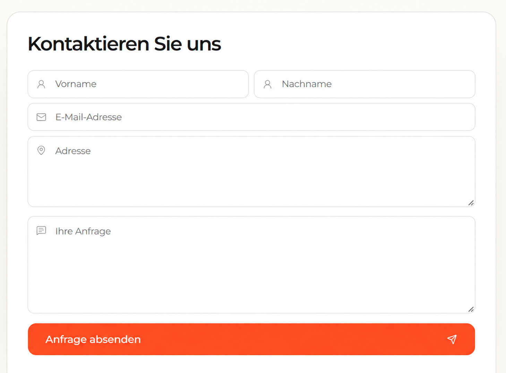

# `form`

## Скриншот

## Назначение

Стандартный CMS-элемент Shopware для контактной формы на landing page. Витрина поддерживает только тип формы `contact` и выводит поля имени, e-mail, адреса и текста обращения. CAPTCHA в текущей реализации отсутствует.

## Настройка в Shopware

1. Создайте и опубликуйте landing page в Shopware.
2. Назначьте странице Shopping Experience, sales channel и SEO URL, например `/kontakt`.
3. Добавьте в layout стандартный элемент **Formular**.
4. В поле типа выберите **Kontaktformular**.
5. При необходимости заполните заголовок формы.

| Поле                         | Где отображается                                 | Обязательно                 |
| ---------------------------- | ------------------------------------------------ | --------------------------- |
| Тип формы: `Kontaktformular` | Определяет, что витрина выведет контактную форму | Да                          |
| Заголовок                    | `h2` над полями                                  | Нет; по умолчанию `Kontakt` |

## Технический контракт Shopware

- `slot.type`: `form`.
- Данные берутся из `slot.config`; `slot.data` не используется.

| Поле                 | Тип       | Правило                                                                   |
| -------------------- | --------- | ------------------------------------------------------------------------- |
| `config.type.value`  | `contact` | Обязательное значение. `newsletter` и другие типы форм не рендерятся.     |
| `config.title.value` | `string`  | Необязательный непустой заголовок; при отсутствии используется `Kontakt`. |

Если `config.type.value` не равен `contact`, витрина не выводит элемент и регистрирует ошибку CMS-контракта на сервере.

## Отправка обращения

Форма отправляет `POST /store-api/contact/submit`. Сервер проверяет поля и передаёт обращение в Shopware Store API `POST /contact-form`.

| Поле формы                       | Передача в Shopware                                                     |
| -------------------------------- | ----------------------------------------------------------------------- |
| `firstName`, `lastName`, `email` | Одноимённые поля контактного запроса                                    |
| `address`                        | Добавляется в текст обращения после метки `Adresse`                     |
| `comment`                        | Передаётся как текст обращения после метки `Anfrage`                    |
| —                                | Тема создаётся автоматически: `Kontaktanfrage von <Vorname> <Nachname>` |

После успешной отправки форма показывает сообщение об успехе. Некорректные поля возвращают ответ `400`, а недоступность Shopware — `502` и сообщение об ошибке. Получатель и шаблон письма настраиваются в Shopware.
