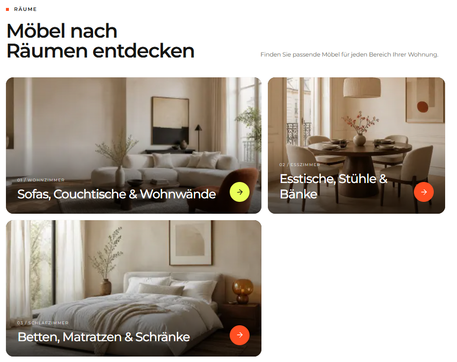

# `jv-article-hero`

## Скриншот

## Назначение

Шапка статьи с заголовком, датой публикации, временем чтения и главным изображением.

## Настройка в Shopware

| Поле                    | Где отображается               | Обязательно |
| ----------------------- | ------------------------------ | ----------- |
| Заголовок               | Главный заголовок статьи       | Да          |
| Дата публикации         | Под заголовком                 | Да          |
| Время чтения            | Рядом с датой, в минутах       | Да          |
| Изображение и alt-текст | Правая часть шапки             | Да          |
| Надзаголовок            | Небольшой текст над заголовком | Нет         |
| Описание                | Текст под заголовком           | Нет         |

## Технический контракт Shopware

- `slot.type`: `jv-article-hero`; данные передаются в `slot.data`.

| Поле                     | Тип      | Правило                                                         |
| ------------------------ | -------- | --------------------------------------------------------------- |
| `title`                  | `string` | Непустая строка.                                                |
| `publishedAt`            | `string` | Допустимая дата-время; выводится в часовом поясе Europe/Berlin. |
| `readTimeMinutes`        | `number` | Положительное целое число.                                      |
| `image.url`              | `string` | Непустой публичный URL медиафайла.                              |
| `image.alt`              | `string` | Необязателен; по умолчанию используется заголовок.              |
| `eyebrow`, `description` | `string` | Необязательные тексты.                                          |

При отсутствии обязательного поля элемент не рендерится.
