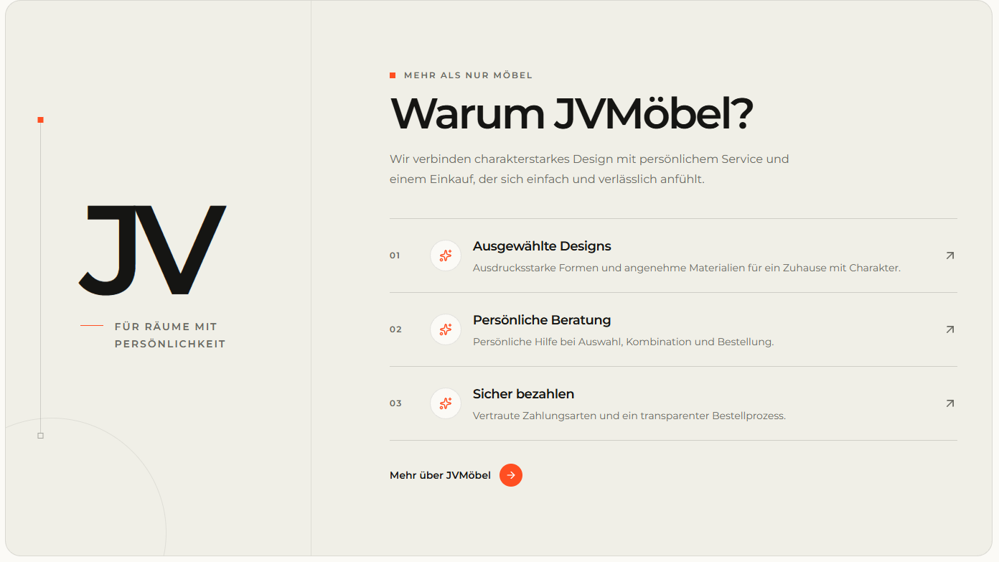

# `jv-author-footer`

## Скриншот

## Назначение

Карточка автора в конце статьи: фотография, специализация, краткая биография и ссылка на профиль.

## Настройка в Shopware

| Поле                  | Где отображается         | Обязательно |
| --------------------- | ------------------------ | ----------- |
| Имя автора            | Заголовок карточки       | Да          |
| Специализация         | Строка «Автор · ...»     | Да          |
| Биография             | Текст под именем         | Да          |
| Фото и alt-текст      | Круглая фотография слева | Да          |
| Текст и ссылка кнопки | Ссылка на профиль автора | Да          |

## Технический контракт Shopware

- `slot.type`: `jv-author-footer`; данные передаются в `slot.data`.

| Поле                             | Тип                        | Правило                                                |
| -------------------------------- | -------------------------- | ------------------------------------------------------ |
| `authorName`, `expertise`, `bio` | `string`                   | Непустые строки.                                       |
| `image.url`                      | `string`                   | Непустой публичный URL.                                |
| `image.alt`                      | `string`                   | Необязателен; по умолчанию имя автора.                 |
| `link.label`, `link.url`         | `string`                   | Обе непустые строки обязательны.                       |
| `link.size`                      | `small \| medium \| large` | Необязателен; сейчас размер визуально не используется. |

При невалидном объекте ссылка или изображения элемент не рендерится.
