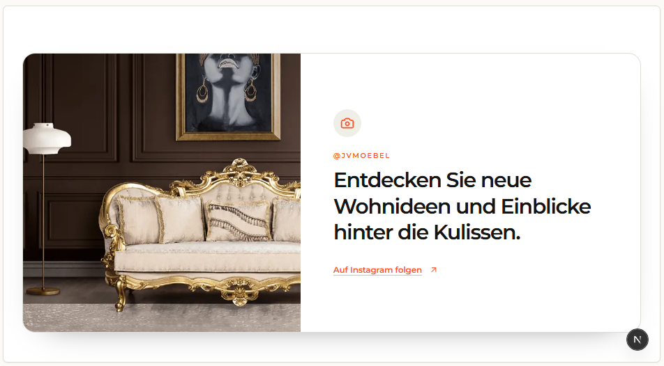

# `jv-benefit-strip`

## Скриншот

## Назначение

Полоса преимуществ магазина: доставка, выгодная цена и условия возврата.

## Настройка в Shopware

| Поле                   | Где отображается            | Обязательно |
| ---------------------- | --------------------------- | ----------- |
| Заголовок преимущества | Основной текст карточки     | Да          |
| Описание               | Текст под заголовком        | Да          |
| Иконка                 | Слева от текста             | Да          |
| Порядок                | Последовательность карточек | Нет         |

Для иконки выберите один из вариантов: «Доставка», «Цена» или «Возврат».

## Технический контракт Shopware

- `slot.type`: `jv-benefit-strip`; данные передаются в `slot.data`.

| Поле                                   | Тип                            | Правило                                                           |
| -------------------------------------- | ------------------------------ | ----------------------------------------------------------------- |
| `items`                                | `array \| object`              | Хотя бы один корректный пункт; массив является основным форматом. |
| `items[].title`, `items[].description` | `string`                       | Непустые строки.                                                  |
| `items[].icon`                         | `delivery \| price \| returns` | Обязательное поддерживаемое значение.                             |
| `items[].id`, `items[].position`       | `string \| number`             | Необязательны; position задаёт порядок.                           |

Некорректные пункты пропускаются; без корректных пунктов элемент не рендерится.
