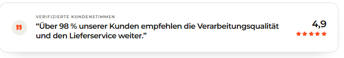

# `jv-expert-profile`

## Скриншот

## Назначение

Расширенная карточка эксперта с фотографией, биографией и ссылкой на профиль.

## Настройка в Shopware

| Поле             | Где отображается      | Обязательно |
| ---------------- | --------------------- | ----------- |
| Имя              | Заголовок карточки    | Да          |
| Роль             | Над именем            | Да          |
| Биография        | Основной текст        | Да          |
| Фото и alt-текст | Левая часть карточки  | Да          |
| Текст и ссылка   | Ссылка под биографией | Да          |

## Технический контракт Shopware

- `slot.type`: `jv-expert-profile`; данные передаются в `slot.data`.

| Поле                     | Тип                        | Правило                              |
| ------------------------ | -------------------------- | ------------------------------------ |
| `name`, `role`, `bio`    | `string`                   | Непустые строки.                     |
| `image.url`              | `string`                   | Непустой публичный URL.              |
| `image.alt`              | `string`                   | Необязателен; по умолчанию имя.      |
| `link.label`, `link.url` | `string`                   | Обе непустые строки обязательны.     |
| `link.size`              | `small \| medium \| large` | Необязателен, по умолчанию `medium`. |

Все основные поля обязательны: при ошибке элемент не рендерится.
