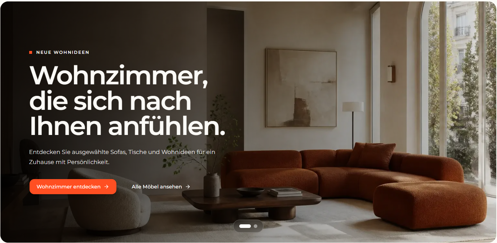

# `jv-expert-tip`

## Скриншот

## Назначение

Компактная плашка с советом эксперта.

## Настройка в Shopware

| Поле         | Где отображается               | Обязательно |
| ------------ | ------------------------------ | ----------- |
| Метка        | Небольшой текст над заголовком | Да          |
| Заголовок    | Основной текст совета          | Да          |
| Текст совета | Описание под заголовком        | Да          |

## Технический контракт Shopware

- `slot.type`: `jv-expert-tip`; данные передаются в `slot.data`.

| Поле                     | Тип      | Правило                        |
| ------------------------ | -------- | ------------------------------ |
| `label`, `title`, `body` | `string` | Каждое поле — непустая строка. |

При отсутствии любого поля элемент не рендерится.
