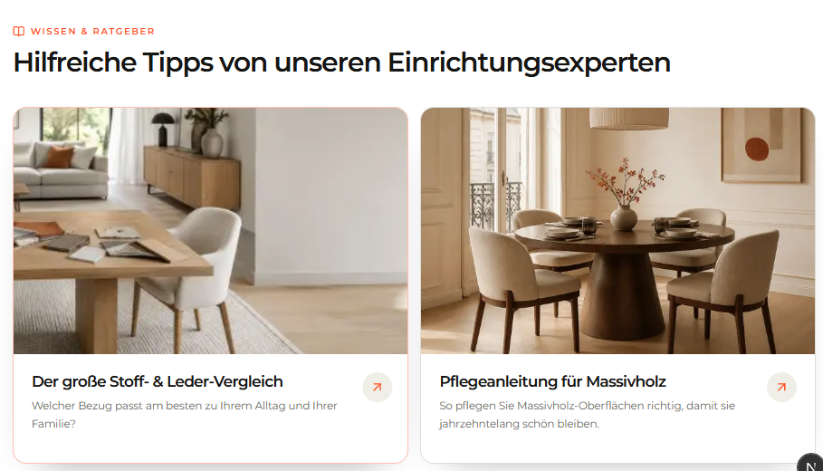

# `jv-faq`

## Скриншот

## Назначение

Раскрывающийся список часто задаваемых вопросов и ответов.

## Настройка в Shopware

| Поле                    | Где отображается                 | Обязательно |
| ----------------------- | -------------------------------- | ----------- |
| Заголовок               | Над списком вопросов             | Да          |
| Надзаголовок и описание | Над заголовком и под ним         | Нет         |
| Вопрос                  | Заголовок раскрывающегося пункта | Да          |
| Ответ                   | Содержимое раскрытого пункта     | Да          |
| Порядок                 | Последовательность вопросов      | Нет         |

## Технический контракт Shopware

- `slot.type`: `jv-faq`; данные передаются в `slot.data`.

| Поле                                 | Тип                | Правило                                 |
| ------------------------------------ | ------------------ | --------------------------------------- |
| `title`                              | `string`           | Непустая строка.                        |
| `eyebrow`, `description`             | `string`           | Необязательные тексты.                  |
| `items`                              | `array \| object`  | Хотя бы один корректный вопрос.         |
| `items[].question`, `items[].answer` | `string`           | Непустые строки.                        |
| `items[].id`, `items[].position`     | `string \| number` | Необязательны; position задаёт порядок. |

Некорректные вопросы пропускаются; без корректных вопросов элемент не рендерится.
