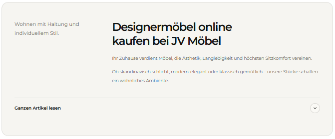

# `jv-guide-hub-cards`

## Скриншот

## Назначение

Сетка карточек со ссылками на гайды и редакционные материалы.

## Настройка в Shopware

| Поле                    | Где отображается            | Обязательно |
| ----------------------- | --------------------------- | ----------- |
| Заголовок               | Над карточками              | Да          |
| Надзаголовок            | Над заголовком              | Нет         |
| Название карточки       | Заголовок карточки          | Да          |
| Описание карточки       | Текст под заголовком        | Нет         |
| Изображение и alt-текст | Изображение карточки        | Да          |
| Ссылка                  | Карточка целиком            | Да          |
| Порядок                 | Последовательность карточек | Нет         |

## Технический контракт Shopware

- `slot.type`: `jv-guide-hub-cards`; данные передаются в `slot.data`.

| Поле                                                                         | Тип                | Правило                                          |
| ---------------------------------------------------------------------------- | ------------------ | ------------------------------------------------ |
| `title`                                                                      | `string`           | Непустая строка.                                 |
| `eyebrow`                                                                    | `string`           | Необязательный надзаголовок.                     |
| `cards`                                                                      | `array \| object`  | Хотя бы одна корректная карточка.                |
| `cards[].title`, `cards[].url`                                               | `string`           | Непустые строки.                                 |
| `cards[].image.url`                                                          | `string`           | Непустой публичный URL.                          |
| `cards[].description`, `cards[].image.alt`, `cards[].id`, `cards[].position` | `string \| number` | Необязательны; alt по умолчанию равен заголовку. |

Некорректные карточки пропускаются; без корректных карточек элемент не рендерится.
