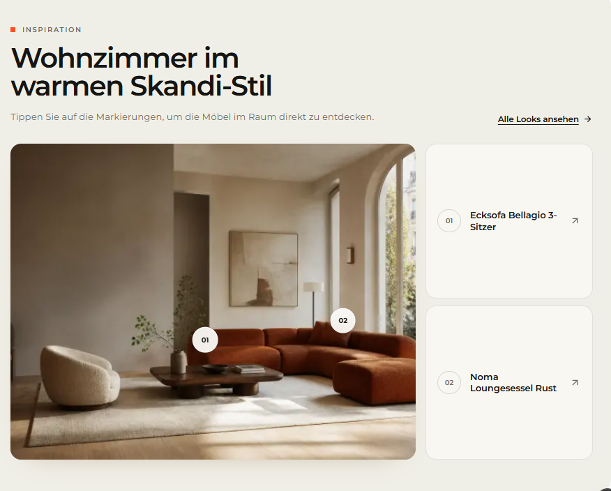

# `jv-hero`

## Скриншот

## Назначение

Главный баннер страницы с одним или несколькими слайдами, кнопками и необязательным промо-предложением.

## Настройка в Shopware

| Поле                             | Где отображается                 | Обязательно      |
| -------------------------------- | -------------------------------- | ---------------- |
| Слайды                           | Каждый экран баннера             | Да, хотя бы один |
| Заголовок и изображение слайда   | Основное содержимое слайда       | Да               |
| Надзаголовок и описание          | Над и под заголовком             | Нет              |
| Вид слайда                       | Вариант расположения содержимого | Нет              |
| Основная и дополнительная кнопка | Кнопки слайда                    | Нет              |
| Промо-текст                      | Плашка предложения               | Нет              |
| Ссылка на весь слайд             | Переход при нажатии вне кнопок   | Нет              |
| Автопрокрутка и интервал         | Поведение карусели               | Нет              |
| Уровень заголовка                | `h1` или `h2` первого слайда     | Нет              |

## Технический контракт Shopware

- `slot.type`: `jv-hero`; данные передаются в `slot.data`.

| Поле                                                                      | Тип                   | Правило                                                                                               |
| ------------------------------------------------------------------------- | --------------------- | ----------------------------------------------------------------------------------------------------- |
| `slides`                                                                  | `array \| object`     | Хотя бы один корректный слайд; массив является основным форматом.                                     |
| `slides[].position`                                                       | `number`              | Обязательное уникальное неотрицательное целое; задаёт порядок.                                        |
| `slides[].title`, `slides[].image.url`                                    | `string`              | Непустые строки.                                                                                      |
| `slides[].image.alt`                                                      | `string`              | Необязателен; по умолчанию пустая строка.                                                             |
| `slides[].layout`                                                         | `featured \| caption` | Необязателен; по умолчанию `featured`.                                                                |
| `slides[].eyebrow`, `slides[].description`, `slides[].url`, `slides[].id` | `string`              | Необязательные поля.                                                                                  |
| `slides[].primaryLink`, `slides[].secondaryLink`                          | `object`              | Необязательны; если переданы, требуются непустые `label` и `url`; `size`: `small \| medium \| large`. |
| `slides[].promotion`                                                      | `object`              | Необязателен; при передаче обязателен `value`, `label` необязателен.                                  |
| `ariaLabel`                                                               | `string`              | Необязательная подпись карусели для скринридера.                                                      |
| `autoplay`                                                                | `boolean \| number`   | `false` или `0` выключают автопрокрутку; по умолчанию включена.                                       |
| `autoplayIntervalMs`                                                      | `number`              | Округляется и ограничивается диапазоном 4000–15000 мс; по умолчанию 7000.                             |
| `headingLevel`                                                            | `h1 \| h2`            | По умолчанию `h1`; используйте `h2`, если `jv-page-header` уже выводит `h1`.                          |

Старый формат одного слайда в корне `slot.data` сохранён для совместимости. Некорректные слайды пропускаются; без корректных слайдов элемент не рендерится.
