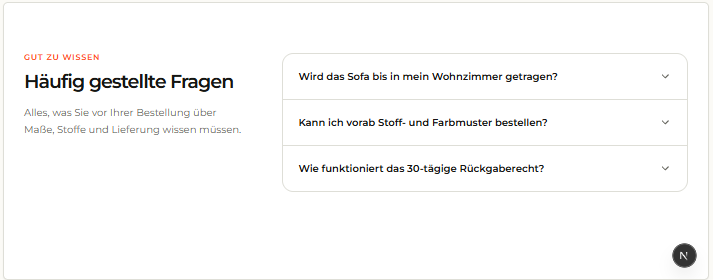

# `jv-home-editorial`

## Скриншот

## Назначение

Раскрывающийся редакционный текст для главной страницы или посадочной страницы.

## Настройка в Shopware

| Поле                      | Где отображается                 | Обязательно             |
| ------------------------- | -------------------------------- | ----------------------- |
| Заголовок                 | Заголовок блока                  | Да                      |
| Короткое утверждение      | Выделенный текст в шапке         | Да                      |
| Вводные абзацы            | Текст до раскрытия               | Да, хотя бы один        |
| Разделы и абзацы          | Текст после раскрытия            | Да, хотя бы один раздел |
| Название раздела          | Заголовок внутри раскрытой части | Нет                     |
| «Показать ещё» и «Скрыть» | Тексты кнопки                    | Да                      |
| Внешний вид               | Карточка или обычный текст       | Нет                     |

## Технический контракт Shopware

- `slot.type`: `jv-home-editorial`; данные передаются в `slot.data`.

| Поле                                                       | Тип                | Правило                                                                          |
| ---------------------------------------------------------- | ------------------ | -------------------------------------------------------------------------------- |
| `title`, `statement`, `showMoreLabel`, `showLessLabel`     | `string`           | Непустые строки.                                                                 |
| `introduction`                                             | `array \| object`  | Хотя бы один непустой текстовый абзац.                                           |
| `sections`                                                 | `array \| object`  | Хотя бы один корректный раздел.                                                  |
| `sections[].paragraphs`                                    | `array \| object`  | Хотя бы один непустой абзац.                                                     |
| `sections[].title`, `sections[].id`, `sections[].position` | `string \| number` | Необязательны; position задаёт порядок разделов.                                 |
| `appearance`                                               | `card \| plain`    | `plain` убирает оформление карточки; другое или отсутствующее значение — `card`. |

Некорректные абзацы и разделы пропускаются; без обязательного текста элемент не рендерится.
