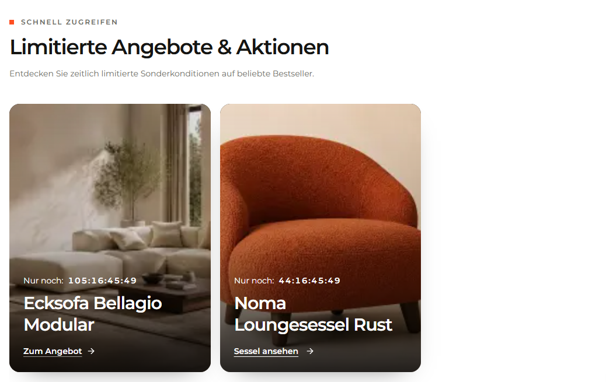

# `jv-instagram-style`

## Скриншот

## Назначение

Карточка публикации в стиле Instagram с именем аккаунта, подписью, изображением и ссылкой.

## Настройка в Shopware

| Поле                    | Где отображается         | Обязательно |
| ----------------------- | ------------------------ | ----------- |
| Имя аккаунта            | В верхней части карточки | Да          |
| Подпись                 | Текст публикации         | Да          |
| Изображение и alt-текст | Основная часть карточки  | Да          |
| Текст и ссылка          | Переход из карточки      | Да          |

## Технический контракт Shopware

- `slot.type`: `jv-instagram-style`; данные передаются в `slot.data`.

| Поле                     | Тип                        | Правило                              |
| ------------------------ | -------------------------- | ------------------------------------ |
| `handle`, `caption`      | `string`                   | Непустые строки.                     |
| `image.url`              | `string`                   | Непустой публичный URL.              |
| `image.alt`              | `string`                   | Необязателен; по умолчанию подпись.  |
| `link.label`, `link.url` | `string`                   | Обе непустые строки обязательны.     |
| `link.size`              | `small \| medium \| large` | Необязателен, по умолчанию `medium`. |

При отсутствии обязательных данных элемент не рендерится.
