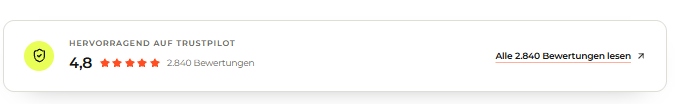

# `jv-loyalty-promo`

## Скриншот

## Назначение

Промо-блок программы лояльности с изображением, перечнем преимуществ, кнопкой и промокодом.

## Настройка в Shopware

| Поле                    | Где отображается          | Обязательно      |
| ----------------------- | ------------------------- | ---------------- |
| Заголовок и описание    | Левая часть блока         | Заголовок — да   |
| Преимущество            | Каждый пункт списка       | Да, хотя бы один |
| Изображение и alt-текст | Правая часть блока        | Да               |
| Текст и ссылка кнопки   | Кнопка действия           | Да               |
| Промокод                | Плашка рядом с кнопкой    | Нет              |
| Порядок преимуществ     | Последовательность списка | Нет              |

## Технический контракт Shopware

- `slot.type`: `jv-loyalty-promo`; данные передаются в `slot.data`.

| Поле                                   | Тип                        | Правило                                 |
| -------------------------------------- | -------------------------- | --------------------------------------- |
| `title`                                | `string`                   | Непустая строка.                        |
| `description`, `promoCode`             | `string`                   | Необязательные тексты.                  |
| `benefits`                             | `array \| object`          | Хотя бы один корректный пункт.          |
| `benefits[].text`                      | `string`                   | Непустая строка.                        |
| `benefits[].id`, `benefits[].position` | `string \| number`         | Необязательны; position задаёт порядок. |
| `image.url`                            | `string`                   | Непустой публичный URL.                 |
| `image.alt`                            | `string`                   | Необязателен; по умолчанию заголовок.   |
| `link.label`, `link.url`               | `string`                   | Обе непустые строки обязательны.        |
| `link.size`                            | `small \| medium \| large` | Необязателен, по умолчанию `medium`.    |

Некорректные пункты пропускаются; без одного корректного пункта элемент не рендерится.
