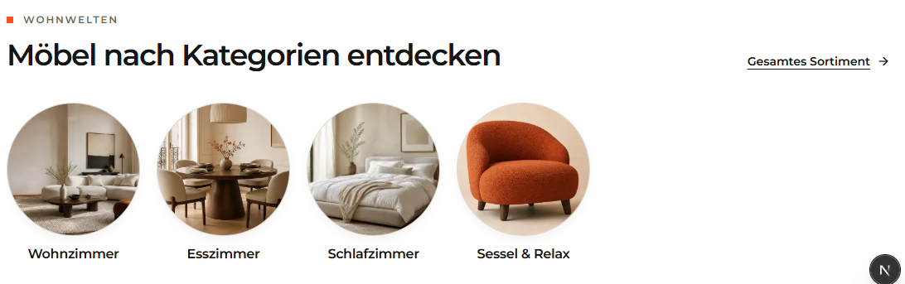

# `jv-page-header`

## Скриншот

## Назначение

Заголовок внутренней страницы с необязательным надзаголовком и описанием.

## Настройка в Shopware

| Поле         | Где отображается       | Обязательно |
| ------------ | ---------------------- | ----------- |
| Заголовок    | Главный `h1` страницы  | Да          |
| Надзаголовок | Над главным заголовком | Нет         |
| Описание     | Под главным заголовком | Нет         |

## Технический контракт Shopware

- `slot.type`: `jv-page-header`; данные передаются в `slot.data`.

| Поле                     | Тип      | Правило                |
| ------------------------ | -------- | ---------------------- |
| `title`                  | `string` | Непустая строка.       |
| `eyebrow`, `description` | `string` | Необязательные тексты. |

При отсутствии `title` элемент не рендерится.
