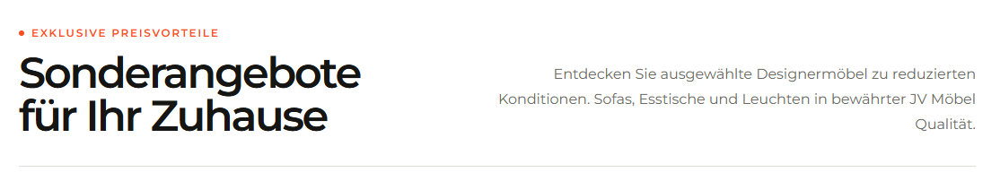

# `jv-shop-the-look`

## Скриншот

## Назначение

Изображение интерьера с интерактивными точками, ведущими к товарам из этой сцены.

## Настройка в Shopware

| Поле                               | Где отображается                  | Обязательно    |
| ---------------------------------- | --------------------------------- | -------------- |
| Заголовок, надзаголовок и описание | Над сценой                        | Заголовок — да |
| Главное изображение и alt-текст    | Сцена интерьера                   | Да             |
| Название товара                    | В карточке по интерактивной точке | Да             |
| Описание товара                    | В карточке по интерактивной точке | Нет            |
| Положение точки X/Y                | Место точки на изображении        | Да             |
| Ссылка товара                      | Переход из точки                  | Да             |
| Ссылка «Смотреть все»              | Под сценой                        | Нет            |
| Порядок                            | Последовательность товаров        | Нет            |

Координаты точки задаются в процентах: 0 — левый/верхний край, 100 — правый/нижний.

## Технический контракт Shopware

- `slot.type`: `jv-shop-the-look`; данные передаются в `slot.data`.

| Поле                                                    | Тип                | Правило                                                |
| ------------------------------------------------------- | ------------------ | ------------------------------------------------------ |
| `title`                                                 | `string`           | Непустая строка.                                       |
| `eyebrow`, `description`                                | `string`           | Необязательные тексты.                                 |
| `image.url`                                             | `string`           | Непустой публичный URL.                                |
| `image.alt`                                             | `string`           | Необязателен; по умолчанию заголовок.                  |
| `items`                                                 | `array \| object`  | Хотя бы один корректный товар.                         |
| `items[].name`, `items[].url`                           | `string`           | Непустые строки.                                       |
| `items[].hotspot.x`, `items[].hotspot.y`                | `number`           | Числа в диапазоне от `0` до `100`.                     |
| `items[].description`, `items[].id`, `items[].position` | `string \| number` | Необязательны; position задаёт порядок.                |
| `viewAll.label`, `viewAll.url`                          | `string`           | Необязательная ссылка, но при передаче нужны оба поля. |

Некорректные точки пропускаются; без изображения, заголовка или корректных точек элемент не рендерится.
