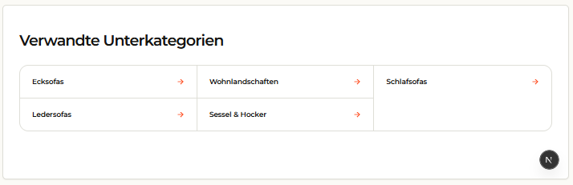

# `jv-trust-rating`

## Скриншот

## Назначение

Блок доверия с рейтингом, числом отзывов, названием площадки и ссылкой на все отзывы.

## Настройка в Shopware

| Поле              | Где отображается  | Обязательно |
| ----------------- | ----------------- | ----------- |
| Название площадки | Над рейтингом     | Да          |
| Рейтинг           | Число и звёзды    | Да          |
| Число отзывов     | Рядом с рейтингом | Да          |
| Текст и ссылка    | Ссылка на отзывы  | Да          |

## Технический контракт Shopware

- `slot.type`: `jv-trust-rating`; данные передаются в `slot.data`.

| Поле                     | Тип                        | Правило                                         |
| ------------------------ | -------------------------- | ----------------------------------------------- |
| `providerLabel`          | `string`                   | Непустая строка.                                |
| `rating`                 | `number`                   | Число от `0` до `5` включительно.               |
| `reviewCount`            | `number`                   | Целое число `0` или больше.                     |
| `link.label`, `link.url` | `string`                   | Обе непустые строки обязательны.                |
| `link.size`              | `small \| medium \| large` | Необязателен; размер визуально не используется. |

При невалидном рейтинге, числе отзывов или ссылке элемент не рендерится.
