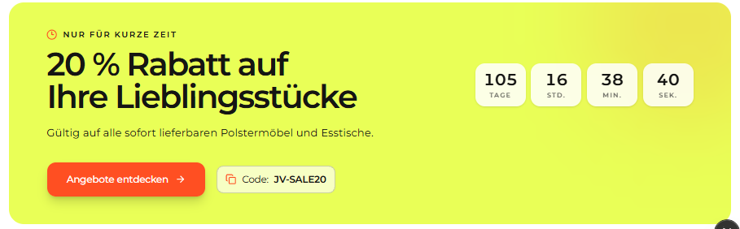

# `jv-why-jvmoebel`

## Скриншот

## Назначение

Брендовый блок с крупной маркировкой, ценностным предложением и ссылками на преимущества магазина.

## Настройка в Shopware

| Поле                                       | Где отображается               | Обязательно    |
| ------------------------------------------ | ------------------------------ | -------------- |
| Маркировка                                 | Крупный текст в левой части    | Да             |
| Слоган                                     | Под маркировкой                | Да             |
| Заголовок, надзаголовок и описание         | Правая часть блока             | Заголовок — да |
| Преимущество: заголовок, описание и иконка | Каждый пункт списка            | Да             |
| Ссылка преимущества                        | Переход из пункта              | Да             |
| Ссылка «Смотреть все»                      | Под списком                    | Нет            |
| Порядок                                    | Последовательность преимуществ | Нет            |

Доступные иконки преимуществ: «Консультация», «Дизайн», «Оплата».

## Технический контракт Shopware

- `slot.type`: `jv-why-jvmoebel`; данные передаются в `slot.data`.

| Поле                                                           | Тип                           | Правило                                                |
| -------------------------------------------------------------- | ----------------------------- | ------------------------------------------------------ |
| `mark`, `tagline`, `title`                                     | `string`                      | Непустые строки.                                       |
| `eyebrow`, `description`                                       | `string`                      | Необязательные тексты.                                 |
| `benefits`                                                     | `array \| object`             | Хотя бы один корректный пункт.                         |
| `benefits[].title`, `benefits[].description`, `benefits[].url` | `string`                      | Непустые строки.                                       |
| `benefits[].icon`                                              | `advice \| design \| payment` | Обязательное поддерживаемое значение.                  |
| `benefits[].id`, `benefits[].position`                         | `string \| number`            | Необязательны; position задаёт порядок.                |
| `viewAll.label`, `viewAll.url`                                 | `string`                      | Необязательная ссылка, но при передаче нужны оба поля. |

Некорректные преимущества пропускаются; без обязательных полей и хотя бы одного преимущества элемент не рендерится.
